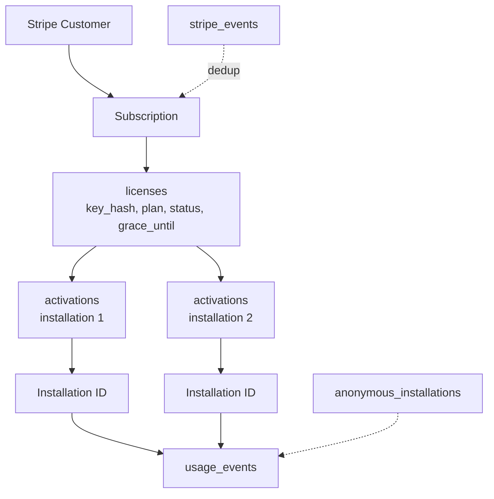
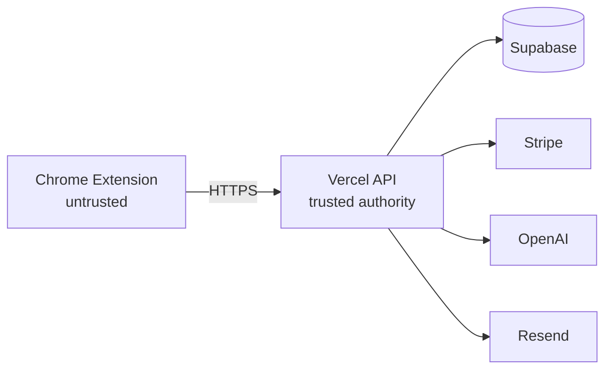

# VibeyCursor — Monetization & Security Architecture (canonical)

> **The extension provides the experience. The backend provides the authority.**
> **Free is useful but constrained. Pro removes meaningful product restrictions
> while the backend retains invisible infrastructure protection.**

This document is the engineering source of truth for licensing, entitlements,
rate limiting, Stripe, and API security. (`AGENT.md` remains the agent
onboarding/product context.)

## Product model

VibeyCursor is a Chrome MV3 extension: hover any element → click → get an
AI-ready design prompt on the clipboard. **Free**: element capture, 20
captures per rolling 20 minutes. **Pro ($9.99/mo, Stripe Payment Link)**:
screenshots, section capture, JSON export, Figma flow, history (50, paginated),
AI prompt rewriting. No password accounts — license-key identity only.

## Identity model

- **Free**: anonymous installation id (`vcDeviceId`, random UUID generated in
  the extension, stored in `chrome.storage.local`). Server records it in
  `anonymous_installations` on first sight. Reinstall = new identity (accepted;
  IP ring + quotas bound the damage).
- **Pro**: Stripe customer → subscription → `licenses` row → `activations`
  rows (max 2 open) → installation ids. License lookup is by **SHA-256 hash**
  (`key_hash`); raw keys exist only in the delivery email, never for lookup.

## Licensing

- Key generated once (`VIBEY-…` format) at `checkout.session.completed`,
  emailed via Resend, hash stored. Plaintext column retained transitionally.
- Activation: `POST /api/activate {licenseKey, installationId}` → 2-slot
  enforcement (409 `activation_limit`), idempotent re-activation, `last_seen`
  touch. Deactivation frees a slot (`POST /api/deactivate`).
- Revocation: cancel/expiry → Free; past-due → Pro until `grace_until`
  (now + `GRACE_DAYS`); support reset = clear activation rows.
- `session-status` never returns keys.

## Subscription lifecycle

`checkout.session.completed` (price-checked when configured) →
`subscription.created/updated` → `invoice.payment_failed` / `async_payment_failed`
→ `subscription.deleted`. Central mapping (`entitlementFor` in
`backend/lib/licensing.js`): active/trialing → Pro; past_due → Pro iff
`now < grace_until`; else Free. Webhooks signature-verified + idempotent via
`stripe_events` PK + naturally-idempotent handlers.

## Entitlement architecture

`GET/POST /api/entitlements` derives `{plan, features, quota}` live from
license → subscription → activation state. Extension caches ≤1h (refresh on
start/activation/hourly/premium-request) and gates via `can(feature)`.
Server re-verifies on every privileged call, so cache is UX-only.

## Rate limiting

- **Business quota (authoritative, persistent):** 20 captures / rolling 20 min
  (free, installation identity) from `usage_events` timestamps; Pro internal
  ceiling 500/day; enhance 50/day/license. Deny = 429 + `retry_after_seconds`.
- **Outer ring (best-effort):** in-memory per-IP fixed windows (decorative on
  serverless, kept as cheap flood brake).
- **Fail-closed:** quota DB errors → 503 + retry hint, never unlimited.

## AI cost protection

`/api/enhance` requires active Pro + open activation slot (+4000-char cap);
counts against 50/day/license; prompt content never stored (hashes/metadata
only). Pro ≠ unlimited spend.

## Security model

The extension is **not** a trusted boundary: storage editable, JS inspectable,
state resettable, fingerprints unreliable. Therefore authorization is enforced
server-side on every privileged operation. Accepted limits: local prompt
strings renderable by modified clients (costs us nothing); reinstall resets
anon identity (IP ring bounds it); Pro cosmetics unlockable locally (no server
value granted).

## Stripe security

Signature verification mandatory; event-id dedup; subscription lifecycle above;
duplicate deliveries safe; price match against `STRIPE_PRO_PRICE_ID` when set
(skipped + logged when unset — see open item).

## API security

Input validation everywhere; client plan/IDs untrusted; entitlement derived
server-side; rate limits per endpoint; contract
400/401/403/404/409/422/429(+retry_after_seconds)/500; no stack traces,
secrets, keys, or DB internals in responses; no raw-key logging.

## Data model

## Trust boundaries

Browser/Extension (untrusted) → HTTPS → Backend API (authority) →
Database/Stripe/OpenAI/Resend (trusted providers). Secrets live in env only.

## Abuse model

Client modification → server re-verification holds. Storage manipulation →
plan re-derived hourly + per-request. License sharing → 2-slot cap + 409.
Reinstall → new identity, IP ring bounds. Replay → live checks defeat stale
responses; webhook dedup defeats duplicate events. Scraping → per-IP ring +
quotas. OpenAI drain → per-license daily cap. IP rotation → accepted residual.

## Operational configuration (`backend/lib/config.js`)

`FREE_CAPTURE_LIMIT=20`, `FREE_CAPTURE_WINDOW_MINUTES=20`,
`PRO_INTERNAL_CAPTURE_LIMIT=500`, `PRO_ENHANCE_LIMIT=50`,
`PRO_ENHANCE_MAX_CHARS=4000`, `MAX_ACTIVE_ACTIVATIONS=2`, `GRACE_DAYS=7`,
`QUOTA_UNAVAILABLE_RETRY_SECONDS=30`, `USAGE_EVENT_RETENTION_DAYS=30`.
Price: `STRIPE_PRO_PRICE_ID` env (authoritative; **OPEN: value not yet
configured — webhook price check logs-and-skips until set**).

## Future extension points

Team plans (activations limit per tier), annual billing (new Price + same
webhook), more AI features (new `usage_events.operation` + cap), higher quotas
(config numbers only), history sync (new table, same identity), enterprise
(SSO would be the first password-adjacent feature — deliberate decision).

## Why no JWT

Hourly entitlement refresh + live server verification on every privileged
operation already neutralize replay value. JWTs would add key management and
revocation complexity without new security. Revisit only if a stateless edge
check becomes necessary.

## AI observability (`ai_usage_events`)

Every server-side OpenAI call records one row: license link, installation
hash, operation (`enhance`; new ops need no redesign), element type
(client-provided, informational only), prompt length (server-measured), model,
**authoritative token counts straight from the API response**
(`input/output/total`, never estimates, never client values), estimated USD
cost (from `backend/lib/ai-costs.js` — gpt-4o-mini $0.15/$0.60 per 1M, an
accounting estimate), latency, status (`allowed`/`failed` + error category),
request id. Failures record NULL tokens, never invented numbers. Nothing
stored: no prompts, no HTML, no keys. Hierarchy stays
**request count (50/day) → token usage → estimated cost**; tokens inform
pricing, they don't gate users.
